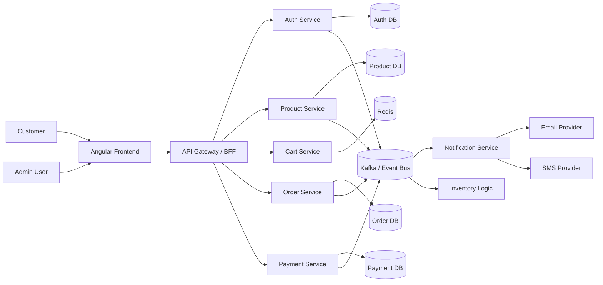
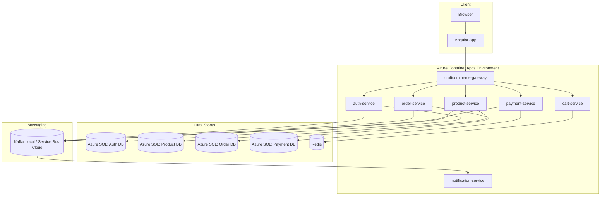
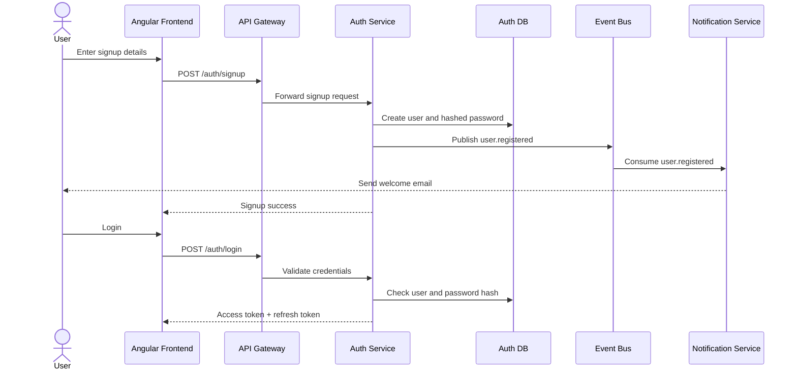
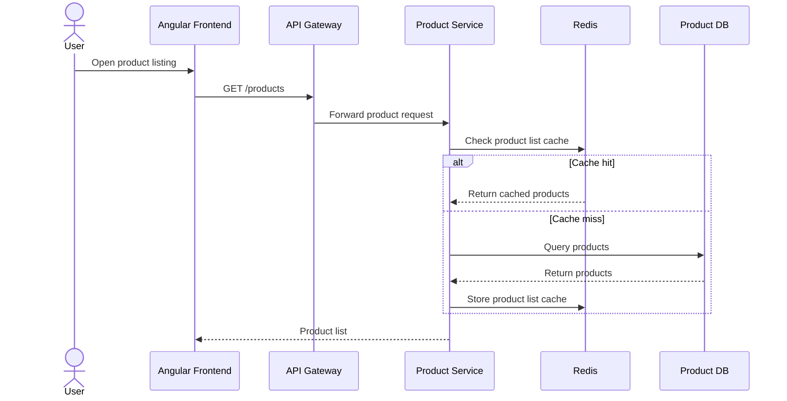
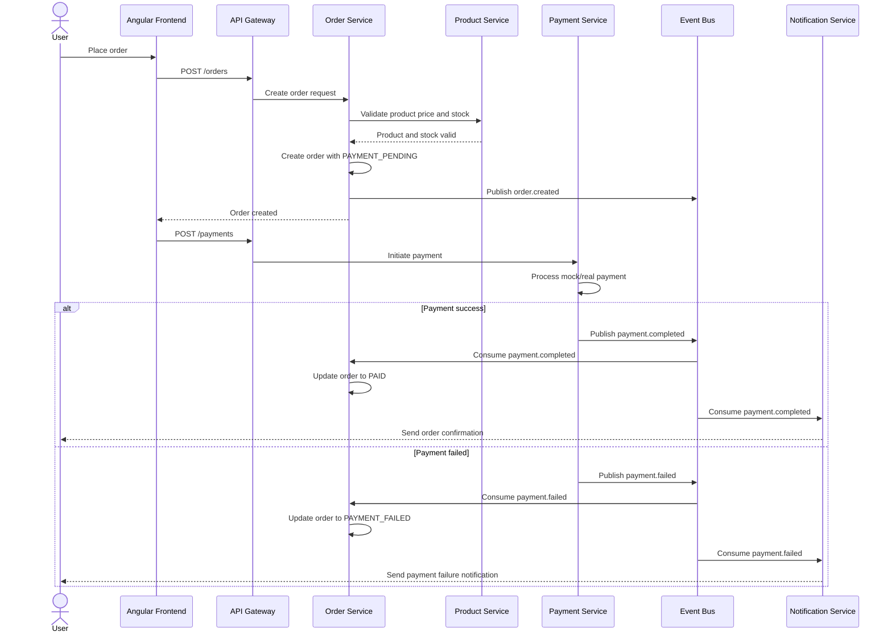
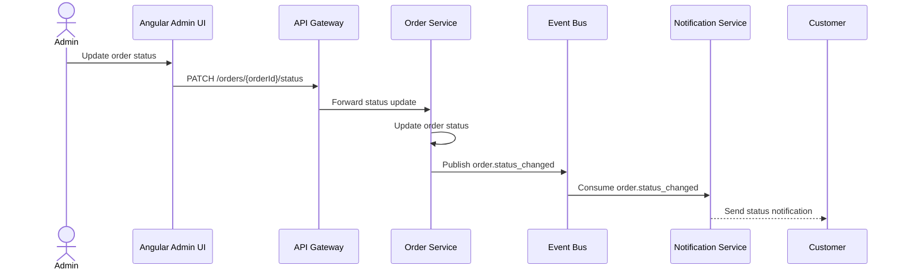
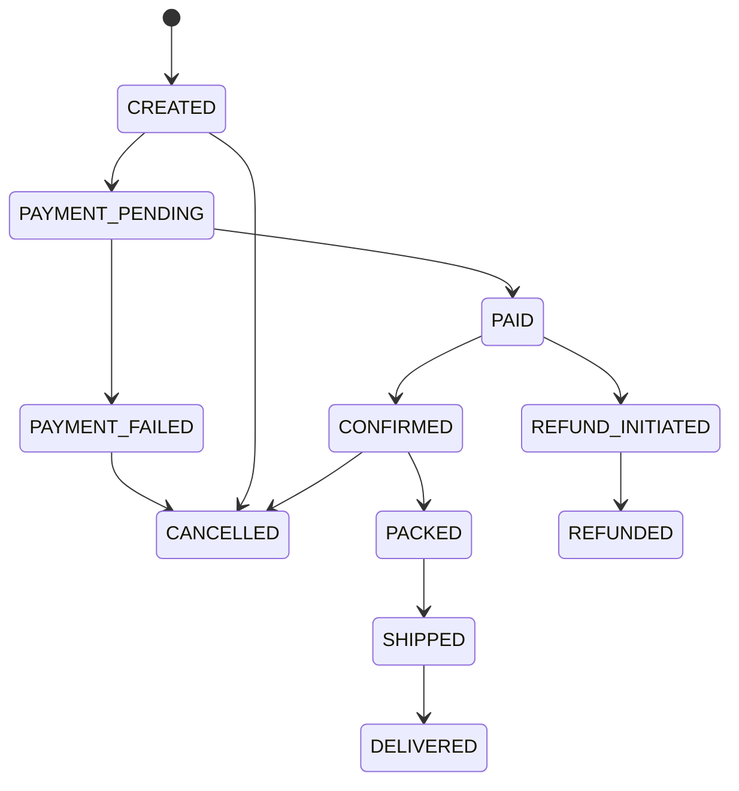
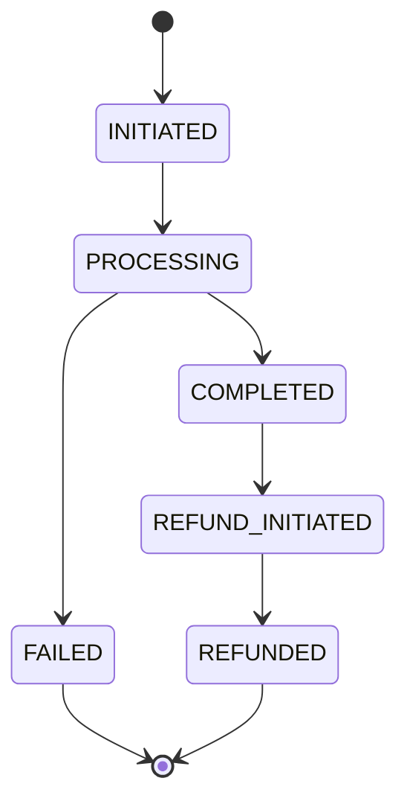
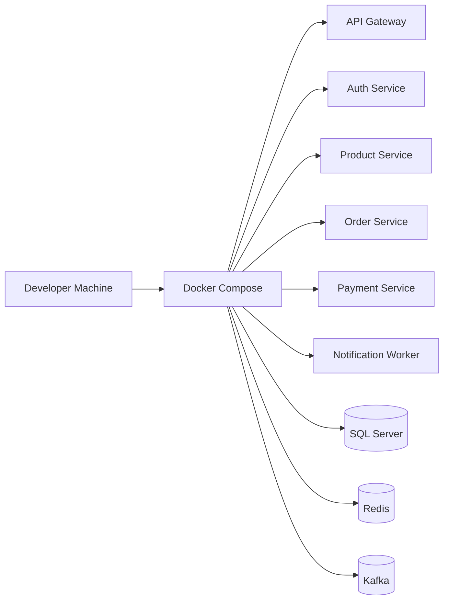
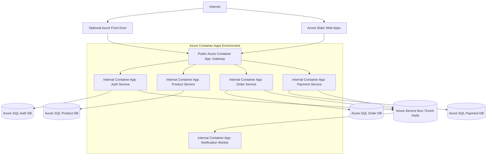

# CraftCommerce High-Level Design

## 1. Project Overview

CraftCommerce is an ecommerce platform for woolen items. The main goal of this project is to learn microservice architecture and important high-level design topics such as JWT authentication, Redis caching, Kafka/event-driven communication, service boundaries, database-per-service design, Docker, and Azure deployment.

The backend will be built first using .NET Core Web APIs. The Angular frontend will be built later after the backend services and deployment approach are stable.

## 2. Main Goals

- Build a real microservice-based ecommerce backend.
- Use .NET Core for backend services.
- Use JWT for authentication and authorization.
- Use Redis for cache, cart, and temporary fast-access data.
- Use Kafka locally for event-driven communication.
- Use Azure Container Apps for low-cost/free-tier-friendly deployment.
- Use Azure SQL Database as the main relational database option.
- Keep every service independently deployable.
- Learn HLD concepts by building them in a practical project.

## 3. Technology Stack

| Area | Recommended Technology |
|---|---|
| Backend | .NET 8 / .NET 9 Web API |
| API Gateway | YARP Reverse Proxy / .NET Gateway |
| ORM | Entity Framework Core |
| Primary Database | Azure SQL Database |
| Local Database | SQL Server Docker container |
| Cache | Redis |
| Local Event Broker | Kafka |
| Cloud Event Broker | Azure Service Bus first, Azure Event Hubs/Kafka later |
| Containerization | Docker |
| Local Orchestration | Docker Compose |
| Cloud Hosting | Azure Container Apps |
| Frontend | Angular |
| Frontend Hosting | Azure Static Web Apps |
| CI/CD | GitHub Actions |
| Secrets | Container App secrets first, Azure Key Vault later |
| Observability | OpenTelemetry + Application Insights later |

## 4. Important Database Decision

Cosmos DB is mainly a NoSQL database. It is useful for document-style data, high-scale distributed data, and flexible schemas, but CraftCommerce has strongly relational data such as users, products, orders, order items, payments, and inventory.

For this project, Azure SQL Database is a better first choice because:

- It works very well with .NET and Entity Framework Core.
- Ecommerce data is naturally relational.
- SQL Server tooling is beginner-friendly.
- Azure SQL has a free offer suitable for learning.
- The database-per-service pattern can be practiced cleanly.

MySQL or PostgreSQL can also work, but on Azure they are usually more limited from a free-tier perspective. Azure SQL is the recommended option for this project.

## 5. System Context Diagram



## 6. Target Microservices

| Service | Type | Main Responsibility |
|---|---|---|
| API Gateway | .NET Web API / YARP | Single public entry point, routing, JWT validation, rate limiting |
| Auth Service | .NET Web API | Signup, login, JWT, refresh tokens, roles |
| User/Profile Service | .NET Web API | Profile, address book, customer preferences |
| Product Service | .NET Web API | Product catalog, categories, price, images, inventory display |
| Cart Service | .NET Web API | Add/remove cart items, cart summary, Redis-backed cart |
| Order Service | .NET Web API | Order creation, order status, order history |
| Payment Service | .NET Web API | Payment initiation, payment confirmation, refunds later |
| Notification Service | .NET Worker Service | Email/SMS notifications from events |
| Inventory Service | .NET Worker/API later | Stock reservation, stock release, stock updates |

For the first version, Inventory can stay inside Product Service. It can be separated later after the core order flow is working.

## 7. Recommended First Version Scope

Start with these services:

1. API Gateway
2. Auth Service
3. Product Service
4. Order Service
5. Payment Service
6. Notification Service
7. Redis
8. Kafka locally

Add Cart Service and a separate Inventory Service after the basic order and payment flow is stable.

## 8. Service Ownership and Database Plan

Each service owns its own database. Other services must not directly read or write another service's database.

| Service | Database | Main Tables |
|---|---|---|
| Auth Service | `craft_auth_db` | `users`, `roles`, `user_roles`, `refresh_tokens` |
| Product Service | `craft_product_db` | `products`, `categories`, `product_images`, `inventory` |
| Cart Service | Redis first | `cart:{userId}`, `cart:{anonymousId}` |
| Order Service | `craft_order_db` | `orders`, `order_items`, `order_status_history` |
| Payment Service | `craft_payment_db` | `payments`, `payment_attempts`, `refunds` |
| Notification Service | `craft_notification_db` optional | `notification_logs`, `notification_templates` |
| User/Profile Service | `craft_user_db` | `profiles`, `addresses` |

## 9. High-Level Container Diagram



## 10. User Flow: Signup and Login



## 11. User Flow: Browse Products



## 12. User Flow: Place Order and Payment



## 13. User Flow: Order Status Updates



## 14. Event Topics

| Topic | Producer | Consumer | Purpose |
|---|---|---|---|
| `user.registered` | Auth Service | Notification Service | Send welcome notification |
| `user.login_succeeded` | Auth Service | Audit/Notification later | Optional login audit |
| `product.created` | Product Service | Search/Cache later | Product catalog sync |
| `product.updated` | Product Service | Search/Cache later | Product change sync |
| `inventory.low` | Product/Inventory Service | Notification Service | Alert admin about low stock |
| `order.created` | Order Service | Notification Service, Inventory logic | Order created notification and stock reservation |
| `order.cancelled` | Order Service | Notification Service, Inventory logic | Cancel notification and stock release |
| `order.status_changed` | Order Service | Notification Service | Notify customer about shipping/delivery status |
| `payment.initiated` | Payment Service | Audit/Order later | Track payment started |
| `payment.completed` | Payment Service | Order Service, Notification Service | Mark order as paid and notify customer |
| `payment.failed` | Payment Service | Order Service, Notification Service | Mark order as failed and notify customer |
| `refund.initiated` | Payment Service | Order Service, Notification Service | Track refund process |
| `refund.completed` | Payment Service | Order Service, Notification Service | Update order and notify customer |

## 15. Standard Event Envelope

All events should use a common envelope so services can process them consistently.

```json
{
  "eventId": "2e4018a9-4be1-4e2a-a7b5-80f8c4a33b7b",
  "eventType": "ORDER_CREATED",
  "source": "order-service",
  "version": "1.0",
  "occurredAt": "2026-06-13T10:30:00Z",
  "correlationId": "req-12345",
  "data": {
    "orderId": "ORD-1001",
    "userId": "USR-501",
    "totalAmount": 2499.00,
    "currency": "INR"
  }
}
```

## 16. Example Events

### `user.registered`

```json
{
  "eventId": "uuid",
  "eventType": "USER_REGISTERED",
  "source": "auth-service",
  "version": "1.0",
  "occurredAt": "2026-06-13T10:30:00Z",
  "correlationId": "req-001",
  "data": {
    "userId": "USR-501",
    "email": "customer@example.com",
    "firstName": "Anu"
  }
}
```

### `order.created`

```json
{
  "eventId": "uuid",
  "eventType": "ORDER_CREATED",
  "source": "order-service",
  "version": "1.0",
  "occurredAt": "2026-06-13T10:30:00Z",
  "correlationId": "req-002",
  "data": {
    "orderId": "ORD-1001",
    "userId": "USR-501",
    "totalAmount": 2499.00,
    "currency": "INR",
    "items": [
      {
        "productId": "PROD-101",
        "quantity": 2,
        "unitPrice": 999.50
      }
    ]
  }
}
```

### `payment.completed`

```json
{
  "eventId": "uuid",
  "eventType": "PAYMENT_COMPLETED",
  "source": "payment-service",
  "version": "1.0",
  "occurredAt": "2026-06-13T10:35:00Z",
  "correlationId": "req-003",
  "data": {
    "paymentId": "PAY-9001",
    "orderId": "ORD-1001",
    "userId": "USR-501",
    "amount": 2499.00,
    "currency": "INR",
    "paymentProvider": "MOCK"
  }
}
```

## 17. Order State Machine



## 18. Payment State Machine



## 19. JWT Authentication Design

The Auth Service is responsible for issuing JWT access tokens and refresh tokens.

### Access Token Claims

```json
{
  "sub": "USR-501",
  "email": "customer@example.com",
  "roles": ["CUSTOMER"],
  "iat": 1718270000,
  "exp": 1718271800
}
```

### Token Plan

| Token | Lifetime | Storage |
|---|---|---|
| Access token | 15-30 minutes | Frontend memory or local storage during learning |
| Refresh token | 7-30 days | Auth DB and secure cookie later |

The API Gateway should validate JWTs before forwarding protected requests to internal services. Services can also validate JWTs for defense in depth.

## 20. Redis Usage

| Use Case | Service | Key Example |
|---|---|---|
| Cart storage | Cart Service | `cart:user:{userId}` |
| Anonymous cart | Cart Service | `cart:anon:{anonymousId}` |
| Product cache | Product Service | `products:list:{categoryId}` |
| Product details cache | Product Service | `product:{productId}` |
| Rate limiting | API Gateway | `rate:{userId}:{minute}` |
| Token blacklist | Auth Service | `jwt:blacklist:{tokenId}` |
| Idempotency | Order/Payment Service | `idem:{requestKey}` |

## 21. API Gateway Responsibilities

The API Gateway should be the only public backend entry point.

Responsibilities:

- Route requests to internal services.
- Validate JWTs.
- Apply basic rate limiting.
- Add correlation IDs.
- Handle CORS for Angular.
- Hide internal service URLs.
- Provide a stable API surface for the frontend.

Example routes:

| Public Route | Internal Service |
|---|---|
| `/api/auth/*` | Auth Service |
| `/api/products/*` | Product Service |
| `/api/cart/*` | Cart Service |
| `/api/orders/*` | Order Service |
| `/api/payments/*` | Payment Service |

## 22. Local Development Architecture



Local development should use Docker Compose with:

- SQL Server container
- Redis container
- Kafka container
- All .NET services
- Optional Angular frontend later

## 23. Azure Deployment Architecture



## 24. Azure Resource Plan

| Resource | Purpose | Recommendation |
|---|---|---|
| Azure Container Apps | Run .NET services as containers | Use consumption plan and scale-to-zero where possible |
| Azure SQL Database | Relational DB per service | Use Azure SQL free offer |
| Azure Static Web Apps | Host Angular frontend later | Use free tier |
| Azure Container Registry | Store Docker images | Optional; Docker Hub can be used to reduce Azure usage |
| Azure Service Bus | Cloud async messaging | Use first for cloud deployment |
| Azure Event Hubs | Kafka-compatible learning later | Use when specifically learning Kafka-on-Azure |
| Azure Key Vault | Secrets | Add later |
| Application Insights | Logs/traces | Add later |

## 25. Kafka and Azure Messaging Strategy

Kafka is important for learning, but running Kafka 24/7 in Azure free-tier-friendly infrastructure is not ideal. Kafka is stateful and usually wants always-running brokers.

Recommended strategy:

| Stage | Messaging Approach |
|---|---|
| Local development | Real Kafka in Docker Compose |
| First Azure deployment | Azure Service Bus |
| Advanced Azure learning | Azure Event Hubs Kafka-compatible endpoint |
| Production-style later | Managed Kafka / Event Hubs / AKS Kafka |

To avoid locking the code to one provider, create an event bus abstraction:

```csharp
public interface IEventBus
{
    Task PublishAsync<T>(string topic, T message, CancellationToken cancellationToken = default);
    Task SubscribeAsync<T>(
        string topic,
        string consumerGroup,
        Func<T, CancellationToken, Task> handler,
        CancellationToken cancellationToken = default);
}
```

Possible implementations:

- `KafkaEventBus`
- `AzureServiceBusEventBus`
- `InMemoryEventBus`

## 26. Multiple Azure Account Plan

Using multiple Azure accounts can help with learning and free-tier experiments, but the architecture should not depend on multiple accounts.

Recommended setup:

| Account/Subscription | Usage |
|---|---|
| Account 1 | Main backend APIs and Azure SQL databases |
| Account 2 | Optional frontend, experiments, alternate deployments |
| Account 3 | Optional Kafka/VM experiments only |

Start with one account first. Add more only if you hit free-tier limits or want isolated experiments.

## 27. Deployment Phases

### Phase 1: Local Backend

- Create .NET solution.
- Create Auth Service.
- Create Product Service.
- Create Order Service.
- Create Payment Service.
- Create Notification Worker.
- Add SQL Server container.
- Add Redis container.
- Add Kafka container.
- Add Docker Compose.

### Phase 2: Basic Service Integration

- Add JWT login.
- Add gateway routing.
- Add product browsing.
- Add order creation.
- Add mock payment.
- Publish events to Kafka.
- Consume events in Notification Service.

### Phase 3: Azure SQL Migration

- Create Azure SQL databases.
- Add EF Core migrations.
- Configure connection strings.
- Run migrations against Azure SQL.
- Keep each service database separate.

### Phase 4: Azure Container Apps Deployment

- Create Dockerfiles for all services.
- Build and push images.
- Create Azure Container Apps environment.
- Deploy gateway as public app.
- Deploy internal services as private apps.
- Configure secrets and environment variables.
- Test API flow through gateway.

### Phase 5: Cloud Messaging

- Add `IEventBus` abstraction.
- Keep Kafka implementation for local.
- Add Azure Service Bus implementation for cloud.
- Switch implementation by environment variable.

### Phase 6: Angular Frontend

- Build Angular application.
- Connect to gateway APIs.
- Deploy to Azure Static Web Apps.
- Add authentication flow.
- Add product listing, cart, checkout, and orders.

## 28. Suggested Repository Structure

```text
craftcommerce/
  src/
    gateway/
      CraftCommerce.Gateway/
    services/
      auth/
        CraftCommerce.Auth.Api/
      product/
        CraftCommerce.Product.Api/
      order/
        CraftCommerce.Order.Api/
      payment/
        CraftCommerce.Payment.Api/
      notification/
        CraftCommerce.Notification.Worker/
      cart/
        CraftCommerce.Cart.Api/
    building-blocks/
      CraftCommerce.Shared/
      CraftCommerce.EventBus/
  deploy/
    docker-compose.yml
    azure/
      container-apps/
      sql/
  docs/
    craftcommerce-high-level-design.md
  tests/
```

## 29. Build Order

1. Create solution and repo structure.
2. Build Auth Service with JWT.
3. Build Product Service with product CRUD.
4. Build API Gateway with YARP.
5. Build Order Service.
6. Build Payment Service with mock payment.
7. Add Kafka locally.
8. Add Notification Worker.
9. Add Redis for cart/cache.
10. Add Docker Compose.
11. Deploy databases to Azure SQL.
12. Deploy services to Azure Container Apps.
13. Add Azure Service Bus event bus implementation.
14. Build Angular frontend.

## 30. Non-Functional Requirements

| Requirement | Plan |
|---|---|
| Scalability | Scale each service independently in Azure Container Apps |
| Availability | Start simple; add health checks and retries |
| Security | JWT, HTTPS, internal services, secrets |
| Observability | Correlation IDs, structured logs, OpenTelemetry later |
| Cost control | Use free-tier services and scale-to-zero |
| Maintainability | Service boundaries, EF migrations, event contracts |
| Reliability | Idempotency keys, retries, dead-letter queues later |

## 31. Key Learning Topics Covered

- Microservice boundaries
- Database per service
- API Gateway pattern
- JWT authentication
- Refresh tokens
- Redis caching
- Redis cart storage
- Kafka topics and consumers
- Event-driven architecture
- Eventual consistency
- Docker and Docker Compose
- Azure Container Apps
- Azure SQL Database
- Cloud messaging with Azure Service Bus
- CI/CD basics
- Observability basics

## 32. Final Recommendation

The most practical and strong learning architecture is:

```text
.NET Core APIs
+ YARP API Gateway
+ EF Core
+ Azure SQL database per service
+ Redis locally
+ Kafka locally
+ Azure Service Bus for first cloud deployment
+ Azure Container Apps
+ Angular frontend later
```

This keeps the project realistic, cost-controlled, and aligned with the main goal: learning microservice architecture by building a complete ecommerce system.
